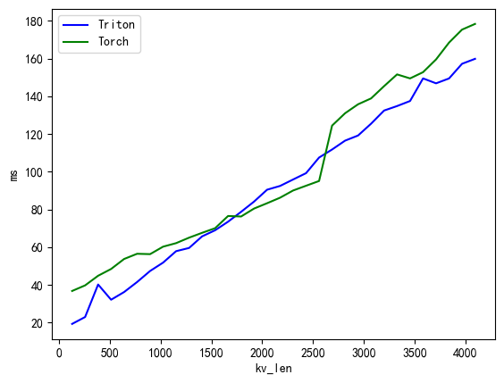
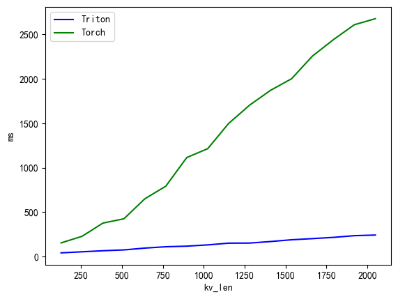
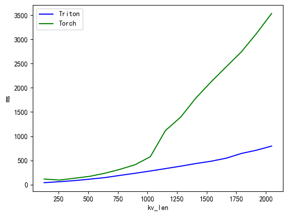
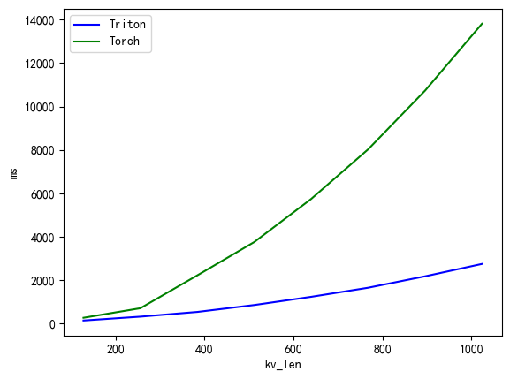

# 1 快速使用

## 1.1 克隆下来

```python
git clone https://github.com/mdy666/triton-mla.git
cd triton-mla
```

## 1.2 示例代码

```python
path = 'model_path'
dtype = torch.float16
device = 'cuda'
max_new_tokens = 100

config = AutoConfig.from_pretrained(path, trust_remote_code=True)
config.torch_dtype = dtype
# 下面两行为必须的两行，引入mla
config._attn_implementation = 'eager'
# 1是torch_mla, 2是triton_mla, 0是原始attention
config.eager_idx = 2


tokenizer = AutoTokenizer.from_pretrained(path, trust_remote_code=True)
tokenizer.padding_side = 'left'
tokenizer.pad_token_id = 0
prompts1 = [{'role': 'user', 'content': '介绍一下故宫，不少于100字'}] # 可以解决padding问题
prompts2 = [{'role': 'user', 'content': '你是谁'}]
text = [tokenizer.apply_chat_template(i, add_generation_prompt=True, tokenize=False) for i in [prompts1, prompts2]]

custom_model = modeling_minicpm.MiniCPM3ForCausalLM.from_pretrained(path, device_map=device, torch_dtype=dtype, config=config)

# 将模型权重进行替换，必须执行的
for m in custom_model.modules():
    if isinstance(m, MiniCPMTrain2Test):
        m.train2test()
print(custom_model)

inputs = tokenizer(text, return_tensors='pt', padding='longest')
inputs = {k:v.cuda() for k,v in inputs.items()}
print(inputs)
with torch.inference_mode():
    torch.manual_seed(42)
    start = time.time()
    model_outputs = custom_model.generate(**inputs, do_sample=True, 
                                        max_new_tokens=max_new_tokens, temperature=0.7, top_p=0.95)
    time2 = time.time() - start
ans = tokenizer.batch_decode(model_outputs, skip_special_tokens=True)
for i in ans:
    print(i)
# user
# 介绍一下故宫，不少于100字 
#  assistant
# 故宫，这座宏伟的皇家宫殿群，位于中国北京的心脏地带，是明清两代皇家权力的象征。它不仅是中国古代建筑艺术的瑰宝，也是世界文化遗产中的一颗璀璨明珠。故宫占地面积约72万平方米，拥有近千间房屋，其规模之宏大、建筑之精美，令人叹为观止。

# 故宫的建筑布局严谨，中轴线贯穿整个宫殿，左右对称，体现了中国古代哲学和美学理念。从午

# user
# 你是谁 
#  assistant
# 你好，我是MiniCPM系列模型，由面壁智能和OpenBMB开源社区开发。详细信息请访问 https://github.com/OpenBMB/
```


## 1.3 文件说明

1. mla_triton.py中定义triton版的mla算子，将mla融入flash_attention
2. mla_attention.py中定了了torch_naive版的mla_attention和triton版的mla_attention
3. modeling_minicpm.py中主要修改了两处，第一处是适配新的Attention模块，第二处是model.forward中triton_mla的attention_mask的更新方式，Ctrl+F搜索“新增修改”
4. test.py中定义了模型权重转换测试(attn)，生成测试(generate)，生成速度对比测试(speed)
5. benchmark.ipynb中进行triton benchmark的性能测试,误差测试和复杂度测试
6. triton_mla_pseudocode.py, 如果看不懂triton的代码没关系，我还写了一个纯torch版的伪代码

# 2 huggingface上推理速度对比
device 4080 12G，存在爆显存的问题。A800机器显卡有些问题，后续会更新成A800的结果。第一行波动比较大，均不是最优结果。
| setting      | TritonMLAMiniCPMAttention | TorchMLAMiniCPMAttention | MiniCPMAttention | MiniCPMFlashAttention2 | MiniCPMSdpaAttention |
| -----------  | ----------- | ----------- | ----------- | ----------- | ----------- |
| bs=8 in=64 out=64    |  5.443   | 5.637   |5.119   |7.37   | 4.87   |
| bs=8 in=256 out=256  |  16.789  | 30.892  |37.746  |112.72 | 57.27  |
| bs=8 in=512 out=512  |  36.747  | 111.037 |526.339 |nan    | 505.87 |
| bs=4 in=1024 out=512 |  34.826  | 96.659  |nan     |nan    | nan    |
| bs=4 in=2048 out=512 |  38.071  | 274.304 |nan     |nan    | nan    |

# 3 triton benchmark性能对比
kv_lora_rank=256 nope_head_dim=64 rope_head_dim=32\
bs=1 num_head=32 q_len=1 decode阶段\
\
bs=4 num_head=32 q_len=1 decode阶段\
\
bs=1 num_head=8 q_len=kv_len prefill阶段\
\
bs=4 num_head=32 q_len=kv_len prefill阶段\
\

# 4 精度问题
精度损失其实还是挺大的，建议使用float16。设置fp32为golden标准，a是triton_mla的结果，b是torch_mla的结果(fp32)\
fp16下    torch.allclose(a, b, 0.001, 0.001)    在0.001左右基本为True\
bf16下    torch.allclose(a, b, 0.005, 0.005)    在0.005左右基本为True


# 5 融合细节
## 5.1 $W_QW_K$融合
注意权重都是单个头的映射权重，即shape都是[hidden_size, head_dim]
$$
\begin{aligned}
QK^T &= xW_Q(xW_K)^T\\
&= xW_QW_K^Tx^T\\
&= x(W_QW_K^T)x^T
\end{aligned}
$$
因此代码中的qk_merge对应的就是$x(W_QW_K^T)$。\
补充一下，为什么nope的可以融合，rope的无法融合呢？\
事实上如果带rope的话，score算的是$rope(xW_Q)rope(xW_K)^T$。这样是无法拆开的，因此只有nope的权重可以融合。
## 5.2 $W_VW_O$融合
论文中还提到了在推理时候$W_VW_O$也是可以融合的。但我发现这样做并不好。可能是我笨，融合的方式不对，欢迎大家探讨。理由如下
$$
\begin{aligned}
OW_O &= [O_1, O_2,..., O_n]·[W_{o_1}, W_{o_2},..., W_{o_n}]^T\\
&= [P_1V_1, P_2V_2,..., P_nV_n]·[W_{o_1}, W_{o_2},..., W_{o_n}]^T\\
&= [P_1xW_{v_1}, P_2xW_{v_2},..., P_nxW_{v_n}]·[W_{o_1}, W_{o_2},..., W_{o_n}]^T\\
&= \sum_{i=1}^{n}P_ixW_{v_i}W_{o_i}\\
&= \sum_{i=1}^{n}P_ix(W_{v_i}W_{o_i})
\end{aligned}
$$

$W_{v_i}$ 的shape是[kv_lora_rank, v_head_dim], $W_{o_i}$ 的shape是[v_head_dim, v_head_dim\*num_head]。一般v_head_dim\*num_head=hidden_size。\
$W_{v_i}W_{o_i}$ 的shape就是[kv_lora_rank, v_head_dim\*num_head] \
首先这个权重很大，没法一次性load进chip中，因此只能放在flash_attn算子外部 \
然后这样做的话flash_attn中输出是o的shape是[bs, num_head, seq_len, kv_lora_rank]\
乘上$W_{v_i}W_{o_i}$之后，需要在num_head这个维度进行加法，把这个维度消掉\
不如把$W_{v_i}$融进flash_attn中，输出o的shape是[bs, num_head, seq_len, v_head_dim]。\
而v_head_dim要不kv_lora_rank小很多，减少store的开销。因此代码中并没有进行$W_VW_O$的融合。\
\
那我是如何做的呢？
首先我并没有把$V_i = xW_{v_i}$直接算出来。而是$(\sum p_{ij}x_j)W_{v_i}$\
区别就是先乘还是后乘。先乘的话(x是compress_kv)，需要对所有的x都乘上这个矩阵(len=kv_len)\
后乘就是对中间结果o乘上这个矩阵(len=q_len)，在解码的时候q_len=BLOCK_M=16，远比kv_len小。\
前者求和里的shape是[q_len, v_head_dim]后者是[q_len, kv_lora_rank]。\
\
另L = math.ceil(N / BLOCK_n), 前者和后者的flops分别为:
$$2 * L * (BLOCK\_M * BLOCK\_N * v\_head\_dim + BLOCK\_N * kv\_lora\_rank * v\_head\_dim)$$
$$2 * (L * (BLOCK\_M * BLOCK\_N * kv\_lora\_rank) + BLOCK\_M * kv\_lora\_rank * v\_head\_dim)$$
推理解码的时候，BLOCK_M设置为16，BLOCK_N设置为128, v_head_dim=64, kv_lora_rank=256, 计算复杂度关系曲线如下:\
\
\
\
当L足够大，理论上前者是后者复杂度的4.25倍

# 6 结束
欢迎大家点个星星，对于我来说第一个比较正式的个人小项目，虽然依然很丑漏！